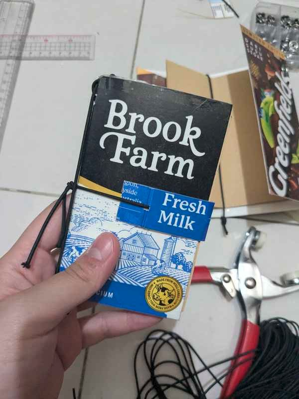

## Reshifting the Focus on Myself

This morning, I woke up and did my chores. I had just resigned from my 9-6 job and now I am currently enjoying my life.
The best part of being unemployed is that I can do whatever I want, whenever I want. I can go to bed late and wake up late. 

I can focus on my health. I can go to the gym more often, hire a PT, and suffer DOMS without guilt of being sub performing. Especially these are my first time on an intense workout regimen. Probably this time only as the next ones will be easier as my muscles have been built.

I can spend more time cooking rather than eating out because I don't have the energy to cook after a long day of work. I barely had the time to prep meals on weekends.

I can learn the things that I have been wanting to learn. Like Japanese. As I will go to Japan for an event on March 2027. Well, I am planning be learning Swedish too right now as I will go to Sweden next month.

## The Unproductive Moments

Continuing the day, after the chores, I saw some finished tetrapack of milk boxes. Then it hit me. Why don't we make a traveller's notebook out of this?

With the idea in mind, I took the items and tools and made a book. Good thing that I got some elastics too.
I didn't bother looking any Youtube videos or anything. No gadgets in view when I was crafting. I just did it.

I mean, it's just a notebook right?

Aannd it's done.

I felt hella proud of myself. In this era of AI, where everything is given in an instant.
Where things can be bought at a cheap price. I still made something by myself. Using waste.

I know that this wouldn't last long tho. Since it was made using cardboard and the elastics were brittle.
But, it's still something right?

Since I was doing it out of an urge to do it, I didn't document the process tbh, without any prior research. But, here are the items needed to make it: Used tetrapacks (from milk cartons), papers, scissors, cutter, elastics, and a ruler. Oh and some glue and tapes.
