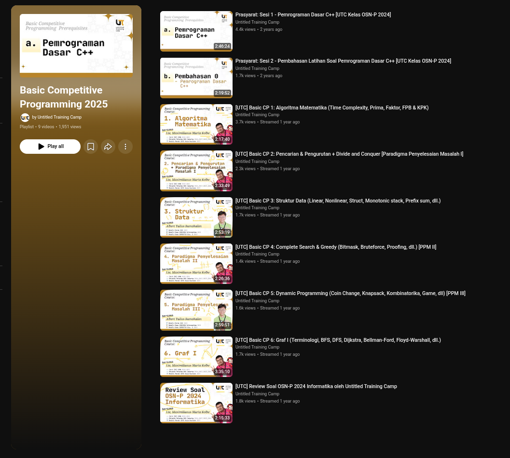
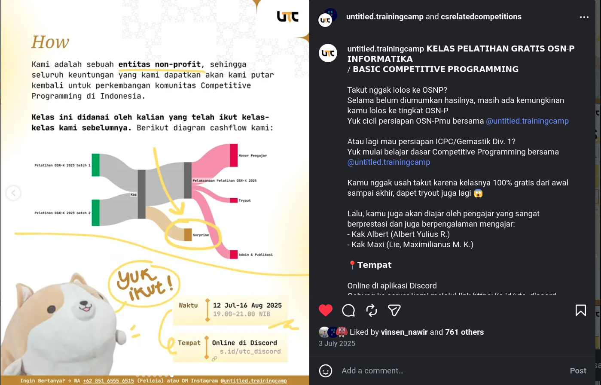

In 2023, [Lie, Maximilianus Maria Kolbe](https://osn.toki.id/statistik/peserta/231) and I had been ranting about how minimal Indonesian resources for Competitive Programming (CP) were. Especially for schools. Knowledge was being guarded inside communities and tutors. The learning curve to be a free learner without a dedicated tutoring place or group was steep. Not impossible, but _steep_.

## Unnamed Supporter

Then, we started Untitled. A nonprofit platform where we and other notable people in the Indonesian CP world can share resources on CP. We named it Untitled because it has the most neutral name. It is not loud. It feels like a background. Perfectly aligned with what we want it to be. We want more people to learn CP easily, and we don't want to take credit for it when it was the students who did most of the work and did the competition. 

We were _just_ guiding them. As unlike schools, people can change tutoring places easily and quickly without commitments. If they don't like us or how we teach, we too don't want to force them to stay or take credit that we are the ones who made them reach the top, which is not true. And, we want people to flock to us because of the experience of the contributors, not the hall of fame of the students who may not have the same learning style as the upcoming students, who may have started years early, which wasn't shown. Everyone has their own timeline, we don't want people to feel they are slow.

## What Controversial Things We Did

We did open seminars for the public. We made high-quality tryouts that we gave out for free to everyone, including the answers and review session. We made a [whole 30++ hours live preparation class for free for the NOI provincial level](https://www.youtube.com/watch?v=zLHsTX7pWfA&list=PLEzQxRybuzFKeRsWRbsaFUtoxOBW14SsG) (OSN-P Informatika). We were tired of seeing olympiad prep turned into an expensive, extractive business where steep fees milked students while the actual contributors saw only a portion of that value. We don't ask for anything in return, not even their names, and not a single registration form. We just want them to have good learning resources.

In all of our classes, we had at least an [International Olympiad in Informatics (IOI)](https://stats.ioinformatics.org/delegations/IDN) medalist to help us out. Oh, we actually had high standards for a contributor, especially the student-facing ones: they needed to have contributed to the National Training Camp, or at least a Provincial Training Camp, and be a competition judge. No other tutoring place set this bar so high. We do.

> Fun fact that is totally irrelevant:
> 
> In 2024, we had JG as our teacher. In 2025 he became Indonesia's IOI delegation deputy leader. In 2025, we had AYR and in 2026, he became a deputy leader too. Not only that, in 2023, we actually had started sharing [free resources with VAF](https://www.instagram.com/p/CqXmfQ7P_0G/), and he became a deputy leader in 2024. Probably a coincidence, though.

Nonprofit does not mean going broke. We need it to be sustainable, thus we take just enough, and the contributors were paid just enough. No profits. We even had a payment scheme where those from the "blessed" provinces needed to pay more for the class than those who aren't. Some provinces have their own budget for training camps to train their delegates in the NOI, some don't.

Well, our tutors were the OG ones with professional teaching experience and top-tier awards, students all over the place tried flocking in. And, we want to encourage people from all over Indonesia, especially the ones who don't have shiny statistics on the leaderboard, to learn here with the best. To encourage them to inspire other people from their province.

## Being too Good

Here's the neat part. Not only students, but parents were flocking in too. I'm not saying that was bad, it is good! Having supportive parents to support our competitive journey? Why not?

But here's the thing. Parents sometimes force their kids into the competitive world, without the kids wanting it. Whether it is for fame, or opening paths in the future, or idk. I'm not saying the parent is wrong to want the best for their offspring, but. But. But sometimes, **the students disrespect the tutor in rebellion**. This stressed the tutors out; they had spent their precious time helping, time already stretched thin between judging competitions, competing, and volunteering, and now they got this? I too wanted to protect the tutors' well-being.

## Sieving the Passive Students

What is the difference between parents and their child? Digital literacy.

I am using this to filter out the parents. I want the students to be proactive themselves. Yes, there may be false positives of filtering out the good parents too, but hey, at least their children are not being sieved out.

Intentionally making the registration more complicated. Intentionally using Discord, a platform that is alien to parents. etc. Like, at least, I can filter out so that only the active students are here. The steps are there, it's just a matter of effort given by the students.

If we are maximizing profits, yes the approach would be to prioritize the parents, they are the ones who have the money anyway. We can make the system parent-oriented and be as seamless to milk as much money as possible. But we don't want to. We don't want education to be for profit. 

Every one of the contributors here has grown to be themselves as a result of receiving help from someone who volunteered to help them, without anything in exchange. We just want to give back. 

And Untitled is one way for us to give back.

## No strings attached

Some people have compared us to other tutoring places. No, we are different.

We are not profit-seeking, and we never intend to be. Any excess earnings are circulated back into Untitled and used to fund the next event, which we will make free for everyone.

And by free, I mean actually free. No strings attached. No selling or collecting private data. No registration required. Just show up and learn.

We don't want Untitled to be the place that makes students successful.

We want Untitled to be the place that makes it easier for students to build their own foundation.

---

## Resources

Everything we make is open and freely accessible to any student who wants to learn:

- Explore the platform at [untitledtc.com](https://untitledtc.com)
  - Roadmaps, practice problems, competitions list, seminars, problem reviews, etc.
- Start learning with the [Basic CP YouTube Playlist](https://s.id/utc_basic-cp)

Want to contribute? Join Untitled's [Discord](https://s.id/utc_discord) and drop me a message through the DMs.