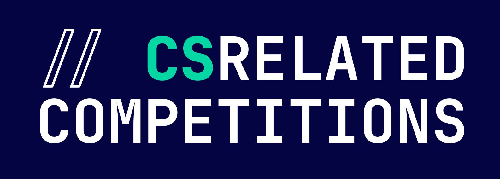
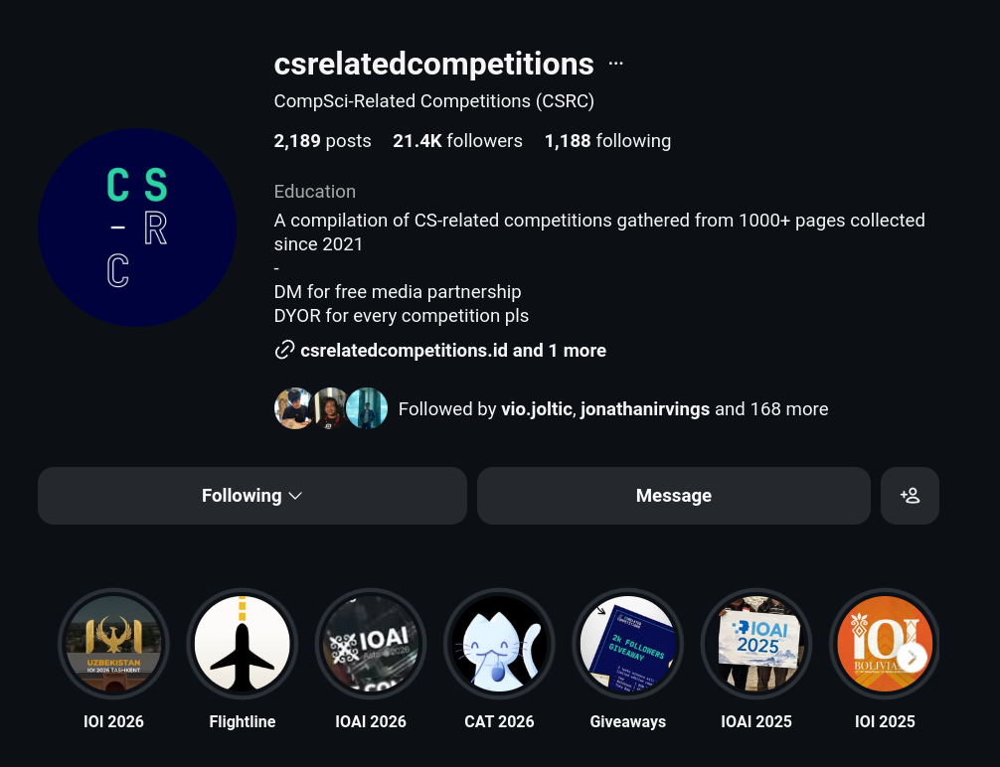
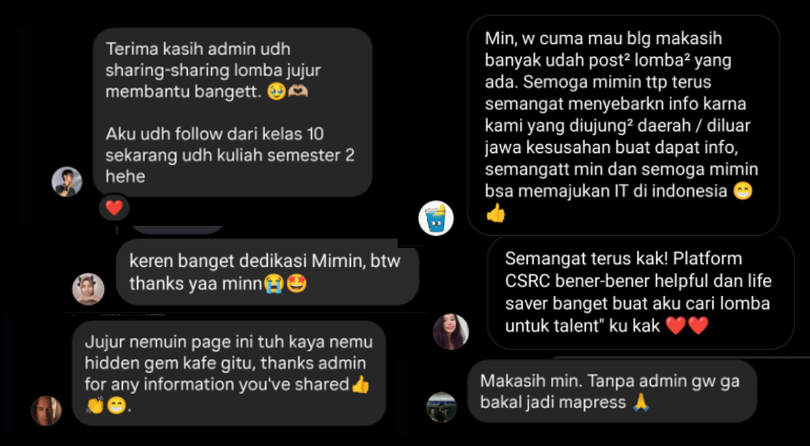

If you ask me what [CS-related Competitions](https://www.instagram.com/csrelatedcompetitions) is, the pitch is simple: an Instagram page (web coming soon) that digs up underexposed competitions and puts them in front of people who can actually compete in them. That’s it.

What started as an accidental fix for my own bad habits ended up quietly reshaping a corner of our tech ecosystem.

## It started from being a manager of a competition team

So, in 2021, I was the manager of a competitive programming team. As the manager of a competition team, I had to funnel my teams into competitions for them to gain experience, network, and achievements.

We can't just do trainings and trainings and trainings. Or mock competitions. The pressure is different. The pressure of real competitions is what can break some people. We need to to be used to the pressure. We need something more realistic and educational for them to grow.

But how do we get competition updates? It was either a competition we knew before, or we waited until someone / the university told us about a new competition. Me? Nah, that's too restrictive.

As an Instagram user, I tried searching for all Competitive Programming competition accounts there, since most people used it for promotion and marketing. Yeah, I didn't use Instagram during High School, so the competitions I joined were the ones recommended by my school; I even got disqualified from a design competition because one of the scoring criteria was likes on an Instagram post.

Then, I saw my personal account followed too many accounts and my feed became a bit too irrelevant to me. Accounts that post competitions might not only post Competitive Programming competitions. Organization accounts post other events too. And some media partners turned this into a for-profit thing, so I couldn't find a single comprehensive account with all the competitions. I needed to follow a lot of them just to get the union of information. Again, super noisy.

## Productive Doomscrolling

You read that right. I had an issue with doomscrolling ~30 mins every day on average. Doomscrolling brain rot.

I knew this wasn't productive. I needed to doomscroll something more productive. 

Given that my personal account was getting cluttered because of all the competitions, I made a new Instagram account: `csrc.id`, CS-related Competitions for Indonesians. A very generic, thoughtful name, right? 👀

I followed tons of Instagram accounts that might post competition info. But then I realized: wait, what about the noise I had from other competitions that weren't competitive programming? Why don't I share these other competitions—like CTF, Hackathons, Data, etc. with others from this account too? I was getting exposed to other competitions while doomscrolling anyway.

I'd had an issue with finding competitions since high school, tbh. But wait: if I had this issue, I couldn't be the only one, right?

If I spend 1 minute searching for competitions, I can save 1 minute for each of the $n$ people I help. As of now, csrc has 21k followers. If $n$ is just 10% of my followers, I am saving 2,100 minutes, or ~35 hours, of everyone's time.

## Hogging Achievements

When I exposed my team to more competitions, our achievement count spiked greatly. Especially since newer team members could participate in smaller, not-so-well-known competitions that the stronger members didn't bother competing in.

The well-known competitions are for the stronger team members to shine. And a learning experience for the aspiring members—especially if they get into the finals. They get to see how the pros do it. They expand their connections. They experience unexpected events worth telling stories about. And they gain experience from the real pressure of competition.

But for the not-so-well-known competitions? That's where the aspiring members shine. The stronger members don't bother entering a competition when they feel they already have plenty of achievements. (Though well, someone who's one of the top programmers in Indo still butchered the smaller competitions too to farm achievements, he's an outlier.) But this is the chance where the volatility of the contest can turn the tables for aspiring members. Of course, we gave feedback to the organizers. We helped boost their participant count. We encouraged them to grow, too.

As manager of the team, I was super happy.
- Achievements — check ✔️
- Experience for team members — check ✔️
- Morale boost — check ✔️

But there was something wrong.

## Undercompeted Competitions

One by one, all of the ranks were being taken by us. Ranks 1-3, us. Runner ups, us. Why was my team dominating so hard? I know my team is good. But why weren't people from other universities joining the ranks? I know there are strong people from other universities too!

Especially in Competitive Programming, a hard-to-learn, hard-to-master field with super objective scoring. The top people will almost always stay at the top, unless they brick or the contest itself is botched.

I asked them. The people from other universities. Their answer? **They didn't know the competition existed**. Almost everyone I asked answered that.

Oh shit.

Yep, my team had me: someone volunteering to spend her time digging up new competitions. But the other universities? Some of their communities weren't even that established yet. They didn't have a source of information for competitions. They only heard echoes rather than announcements. They were just like my team before I came along.

The issue with gatekeeping competitions is that there are fewer participants. Sure, if you want a higher chance to win, you can sabotage the flow of information to reduce the competition.

But that's not how you grow. You don't cut others short to make yourself look tall. You should be the one training to grow higher. Otherwise, you get stuck and stunt your own growth. I didn't want that to happen to my team. I wanted the long-term culture of my team, at least for those who were directly under my management, to not have the mindset of sabotaging to win. I wanted them to win because **they are worthy of winning**.

Not only is it uneducational, it also slowly kills the ecosystem I grew up in: competitions. The continuation of competitions highly depends on the number of participants. If a competition has low participation for several years, there's a non-zero chance it gets discontinued. If competition winners are monopolized by a single affiliation, then something is also wrong. Either with the marketing of the competition, or the ecosystem itself having uneven access to training and resources. But that's a story for another time.

So there's that.

I reached out to other people, sharing about my work. I wanted them to join, compete, and probably butcher my team in competitions. It was fairer for them, a better learning experience for my team, and made competition organizers happier with higher turnout. At a cost, though: I was sacrificing my team's achievement count. But this was better for the long term, for my team, for other university teams, for the organizers, and the ecosystem.

## Lowering the Barrier for Higher Exposure of Competitions 

Previously, I made the account in July 2021 with the Instagram handle was `csrc.id`, which stood for CS-related Competitions for Indonesians. But then I found that CSRC also stood for a religious community, so I changed the name to the expanded version: `csreatedcompetitions`. An even more generic, explanatory name. 👀

As my mission is to help both competitions and potential participants, I don't take any income from this. Zero. No strings attached.

Some media partners offer "free" media partnerships, but with conditions: e.g., requiring $x$ accounts to follow them, or getting $y$ likes across their latest posts, or sharing the partner information throughout $z$ groups.

CSRC? Doing that would raise the barrier to sharing information. The more conditions people have to meet, the higher the barrier. CSRC doesn't have that barrier at all. Our conditions are just:
1. It has to be a CS or CS-related competition.
2. No pay-to-win competitions. The competitions should test actual skill.

That's it. A lot of people have asked me, "Is this real?" They can't believe the conditions are only _that_.

Yep, it's real.

## The Establishment of CS-related Competitions

Some people said I shouldn't have done this for free. But the time I spent here is equivalent to the time I'd spend doomscrolling—which is not productive anyway. And having been in the ICPC community since my university days until now, I'm still keeping up with competition trends regardless.

Some other accounts (not non-profits) have taken credit for my work, directly reposting competitions from CSRC. Well, since my goal is to share competitions as widely as possible, help competitors join more easily, and expose underexposed competitions, doesn't that technically align with my goal? Though it's annoying, we should've collaborated instead of you just profiting off my hard work. Oh well.

Day by day, the follower count grew. Now, competitions, both locally and internationally, reach out to CS-related Competitions for collaborations. Even though our growth wasn't that fast, I feel that our followers are the real people who drive the ecosystem while I get to run the account on my own terms and timeline. Somehow, even the IOI 2026 followed and tagged us in their stories! Isn't this an achievement in itself that money can't buy?

I ran giveaways to clear out duplicate merch I received from competitions (books, bags, tumblers), framed as "milestone celebrations." I keep what I'll actually use and give the rest away. Hopefully, the merch inspires people and promotes the competitions. Plus, I get to declutter. Isn't it lovely to see their smiles (and give these items a second life)?

I've also watched competitions grow from their baby steps to successful now. I've watched people start from scratch who are now representing Indonesia on the global stage. Reading their messages, interacting with them, and hearing their stories, isn't that rewarding?

Being shared across communities internally and externally. Seeing the CSRC profile presented in the classes. Being their go-to place whenever they're looking for a competition. Isn't that fulfilling?

And the opportunities I got from CSRC too: from being noticed by a Indonesian tech community giant and ending up collaborating with them to organize our own competition (with HRT and Google Cloud as sponsors for our first edition), to getting opportunities to volunteer in other regions because of the exposure and track record from CSRC. Isn't that satisfying?

**5 years in, 21k organic followers.**

**No ads. No paid partnerships. Minus profit. No regrets.**

<figure class="article-video">
  <iframe
    src="https://www.youtube.com/embed/IVXVvOqiwac?start=9950"
    title="The start of CS-related Competitions, told during CAT 2026 Final Round Live Commentary"
    allow="accelerometer; clipboard-write; encrypted-media; gyroscope; picture-in-picture; web-share"
    allowfullscreen>
  </iframe>
  <figcaption>The start of CS-related Competitions, told during CAT 2026 Final Round Live Commentary</figcaption>
</figure>