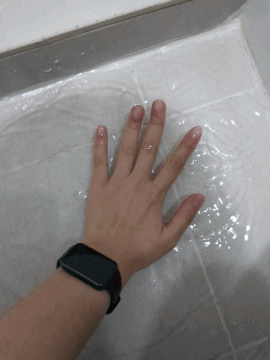

On [Unreal Estate: Losing my Stable Foundation (Apartment)](/articles/unreal-estate), I wrote about skyrocketing apartment rents and my landlord suddenly kicking me out. Then, on [Unreal Estate (2): Dragged into a Mess of Bad Internal Communication](/articles/unreal-estate-2), I wrote about how I was actually kicked out because of a miscommunication between the agents.

Anyways, I thought the new apartment place, everything will be good. The `Me <-> Agent <-> Landlord` communication chain is verified. The agent lives in the apartment (at least this verifies the agent's approval of the apartment building). The unit is newly renovated and fully-furnished. The best part is, the airflow feels amazing (even in Jakarta, at least at night)! The price is higher than my current apartment, but the facilities made me think this is worth the premium.

I signed my contract and was waiting for the moving-in date. Approx ~2 weeks before my last day of my last rent.

I thought my suffering ends here. Spoiler alert: it didn't.

### Intermezzo: High Fever

During the date for key handover, I got sick. Real bad. ~40°C temperature, calculated from my axillary, so probably 41°C-ish inner temperature. Head stinging, sore throat, shivers, aches all over my body, and I couldn't even stand properly.

Yes, I had prepared some emergency food, but the food I had prepared was for when I was having a sore throat XOR fever. NOT BOTH. But yea, anyways I called a friend for help to cook for me since I couldn't eat random food (due to MSG and hygiene issues) alongside the medicines I got from my telemedicine.

Postponed the key handover to two days later, as I needed to be able to stand up when I took in my keys and checked the whole unit to make sure everything was good.

## The New Place

Fast forward two days later. D-day. I met the agent, got the keys. Tested everything. Checked everything. Most looked good. Except, the AC was not working properly. But yea since we only turned on the AC for a short time, it was too early to judge. But my agent, she ack-ed the issue. She also coordinated an AC technician to come. And since everything was good, she left.

Time to clean up the unit!
Vacuumed, mopped, and wiped everything.

Until I accidentally broke the window handle. But uhh, the agent immediately called the Building Management to fix it as the handle was old and worn out. Nice.

And the AC technician got a failing motorbike so the checking needed to be rescheduled the next day. Alright.

## The Sprouting Issue

The next day, I turned on the AC again, about one hour before the AC technician came in. Set on 16°C, cool mode, and highest fan speed. The room was still hot asf. The technician then changed one of the AC capacitors and told me to wait and see. One hour prior was not enough. If it was still hot, then the whole compressor needed to change. Okay.

Five hours in, both rooms were still warm. Took a steak thermometer that I usually use to measure tea temperature. Ah yes, 28°C. Definitely 16°C. Checked the other room, 24°C. Well, slightly better, but those are definitely 16°C. 

Reported this to the agent. She said that the AC was both "cool" already and the technician had repaired the AC. Uh, bro, I have a thermometer so that I can measure the "cool"ness and be less subjective. Kinda enraged, I brought another thermometer, but this time the manual thermometer, not the digital one. Yep, both showed a similar temperature.

The agent still said that the AC was "cool" and was working. WDYM WORKING?? I can't even get a room to be colder than 24°C???

They also said that the room temperature is obviously different than the remote temperature. And so, I set my current room to 17°C and left both thermometers in the room for an hour and when I checked back, one showed 16.9°C and the manual one showed 17-18°C. I can tolerate 1-2°C delta, but 8°C delta? Or even 12°C delta??? Hell no.

The next day, the agent spawned another technician to check on the AC. And indeed, one of the AC compressors overheated and couldn't work properly. Then, I talked a bit with the technician and got some information that the AC model was apparently deprecated and had a known tendency to deteriorate and stop cooling properly. Oh okay. I never had issues with old ACs, but if it doesn't function properly, then it is an issue. 

Reported that to the agent and the agent (or landlord) finally agreed to change the compressor. But only to one AC. The other one? They told me that it was working properly. WTF??? Like what part of "24°C" is considered working properly for an AC that is set to 16°C??????

## The Incidental Pool

Actually, on the day of the key handover, I brushed the bathroom too. Since there were footmarks everywhere and I like things clean. But afterwards, somehow the water puddled. Reported this to the agent. She may have missed the message as we both were too focused on the AC.

The next day, when I was waiting for the AC technician, I saw that the puddle hadn't receded after a day. Well, the slope wasn't directing to the drainage, so it was to be expected that the water puddled.

I then followed up on this issue. The agent said "just use a squeegee to wipe the floor when you finished showering" and "here, the landlord wants to buy one for you". HUH?!? 

I paid the premium here. And this apartment is not a new apartment either (and not that old either), so why tf did no one raise this slope issue??

It's a freaking safety hazard that the water puddles this bad and me slipping here is just a matter of time. So I bought an anti-slip mat while ranting to my agent.

Like, I was having a super high fever and I couldn't even walk properly. And you expect me to wipe the floor every time? And even if I wasn't sick, you expect me to wipe the floor every time after showering? Airbnbs don't even force me to wipe the bathroom floor!

The agent finally spawned two more technicians to check on the bathroom floor. They, within one glance, judged that there couldn't be another solution to fix this issue other than demolishing the tiles and retiling. Asked the timeline, they said the timeline should take about two weeks. Actually, I had asked the multidisciplinary technician that checked on the AC too, and he said the fix should take two weeks, excluding administration. Oh.

Right after I checked out the anti-slip mat from an e-commerce, it hit me. 
**Why am I tolerating these defects?**

I don't even own this place. I'm just renting here.

## The Cost of Staying

It's a freaking hazardous bathroom. It is a disaster waiting to happen.
I don't want to be the victim of the "I slipped and fell and broke my leg" story.

And, obviously, I don't want to pay the premium and live on workarounds.
Well, technically, I can survive on 24°C. But, do I want to? I paid the full price. 

At some point, I had to ask myself whether I was being too demanding.
So I wrote down what I actually prioritize in a place to live:
1. Functional safety
2. Sensory environment
3. Privacy/control
4. Maintenance quality
5. Convenience
6. Aesthetics

I guess this makes sense.

I entered an agreement where the owner is responsible for maintaining the premises. Why am I suddenly being asked to absorb the operational consequences of the owner's infrastructure failure?

That's when, I first brought up about the refund.

And that's when the landlord started treating me seriously. Rather than giving workarounds, they were starting to provide solutions. Though, short-term ones.

But no, the solutions are still too risky.
Replacing the compressor outside the AC unit from another AC? Well, it works, but for how long? How long will it take to break down again? 

Demolishing and reconstructing the whole bathroom floor in 5 days (including curing)? How many corners are cut? All technicians who came to check said that it would need 2 weeks to do it. What are the chances of me finding the new construction to be flawed and needing more fixes? 

How much of my time and energy was wasted in dealing with this? The landlord should've checked on the unit thoroughly before renting it out. And these issues were the issues that I couldn't know during a short-term survey. I mean, I don't expect perfection, but I expect defects to be repairable without fundamentally defeating the purpose of my tenancy.

And, guess what, I got told that I was making too big a deal out of it. The previous tenants didn't complain about this.

Well, good! It means that this is a me-issue and if I cancel, then you wouldn't find it hard to find a replacement, right?

After tons of screenshots and negotiations, I felt that, nah. I couldn't move on with this.

The way the owner solved the problem was not even addressing the root cause. I don't like how they approach a problem. Dismissing my reports. Preferring cheaper and faster workarounds than long-term solutions.

And the good thing is, the negotiations took so much time that the deadline for me to move out came closer and closer. Even though they _generously_ offered to extend my contract, I couldn't afford to wait for the fixes. Nor did I want to tolerate the defects. This put me in a place that I had a good reason to cancel the contract. And another good thing is, the contract does not apply any penalties for cancelled contracts. The contract revisions I had insisted on regarding communication really came in handy.

Losing the deposit is probably negligible to me. One accident would cost me more than the deposit anyway.

## Now What?

I'm not that dumb to cancel a contract without any plans of course. I had contacted my previous agent and had confirmed that the unit I stayed in was still available for renewal. And, at least this time the communication chain would still be `Me <-> Agent <-> Landlord`.

Sigh.

Back to square one, but now I lost a deposit and a big chunk of my September...
All of the stress and time spent are just, gone. The time spent chatting 40+ agents, visiting offline agencies, surveying tons of units, going back and forth with the agent. All gone.

What did I learn though? I really did my due diligence that I assessed that choosing the unknown was better than continuing the known imperfection. I checked everything and I can't even think what else I could've possibly done to avoid this kind of issue in the future.

I don't think I made a bad decision. I learned that some decisions simply cannot be made with certainty beforehand. Due diligence can reduce risk, but it cannot eliminate unknown unknowns. What I can control is how expensive it is to discover that I was wrong. And here I am, looking at the "excessive" backup plans and safety measures I prepared, and seeing that they really paid off.

It's funny that my new rent lasted shorter than my sore throat.

~~I hope this is really the end...~~
